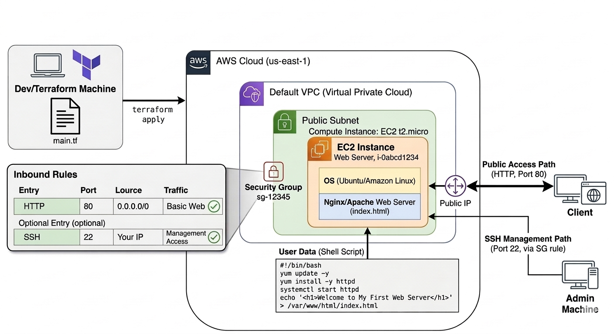

# Deploying First Server to AWS with Terraform

This project provisions a simple web server on AWS using Terraform. It creates an EC2 instance, attaches a security group that allows SSH and HTTP access, and uses a bootstrap script to install Apache and serve a basic web page.

## Project Objective

The goal of this project is to practice Infrastructure as Code by deploying a first server to AWS in a repeatable way with Terraform.

## Architecture Diagram



## What This Project Creates

- An AWS EC2 instance in `us-east-1`
- A security group that allows:
  - SSH on port `22`
  - HTTP on port `80`
- A web server configured with Apache using `user_data`
- A sample homepage that displays `Hello, World from terraform`

## Project Structure

```text
Deploying First Server to AWS/
|-- README.md
|-- screenshots/
|   |-- architecture-diagram.png
|-- terraform/
|   |-- .gitignore
|   |-- main.tf
```

## Terraform Configuration Summary

The Terraform code in [`terraform/main.tf`](./terraform/main.tf) includes:

- The AWS provider configured for `us-east-1`
- An `aws_security_group` resource for inbound web and SSH traffic
- An `aws_instance` resource using a `t2.micro` instance
- A `user_data` script that:
  - Updates packages
  - Installs Apache (`httpd`)
  - Starts and enables the Apache service
  - Creates a default `index.html` page

## Prerequisites

Before running this project, make sure you have:

- An AWS account
- AWS credentials configured locally
- [Terraform](https://developer.hashicorp.com/terraform/downloads) installed

## How to Deploy

1. Open a terminal in the `terraform/` directory.
2. Initialize Terraform:

```bash
terraform init
```

3. Review the execution plan:

```bash
terraform plan
```

4. Apply the configuration:

```bash
terraform apply
```

5. Type `yes` when prompted to confirm deployment.

## How to Verify

After deployment:

- Go to the AWS EC2 console and confirm the instance is running
- Check that the security group allows ports `22` and `80`
- Open the server's public IP address in a browser
- Confirm the page displays `Hello, World from terraform`

## How to Destroy Resources

To avoid unnecessary AWS charges, destroy the infrastructure when you are done:

```bash
terraform destroy
```

## Notes

- The EC2 AMI is hardcoded in `main.tf`
- The instance type is `t2.micro`
- The current configuration is designed for learning purposes and is not production-ready
- Opening SSH and HTTP to `0.0.0.0/0` is convenient for practice but should be restricted in real environments
